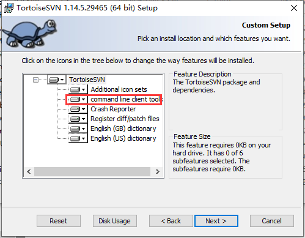

获取Svn的提交版本编号

Q: 找不到svn命令? 

A: 应该是装TortoiseSvn时没有勾选。


```js
import { exec } from 'child_process';

// 获取Svn版本号
function getSvnCommitHash(callback) {
    exec('svn info --show-item revision', (error, stdout, stderr) => {
        callback(stdout.trim());
    });
}

getSvnCommitHash(svnCommitHash => {
    console.log(`当前Svn版本号: ${svnCommitHash}`);
})

```
获取Git的提交版本编号
```js
import { exec } from 'child_process';

// 获取Git版本号
function getGitCommitHash(callback) {
    exec('git rev-parse HEAD', (error, stdout, stderr) => {
        callback(stdout.trim());
    });
}

getGitCommitHash(gitCommitHash => {
    console.log(`当前Git版本号: ${gitCommitHash}`);
});
```

将Dist文件夹打包成Zip并且根据时间版号进行命名

安装依赖包
```shell
npm i jszip -D
```

```js
import "@3r/tool"
import { writeFileSync, readdirSync, statSync, readFileSync } from "fs";
import JSZIP from "jszip";
const zip = new JSZIP();

// 读取文件加入包中
function readFileJoinZip(zip, nowPath) {
    let files = readdirSync(nowPath);
    files.forEach(function (fileName, index) {
        let fillPath = nowPath + "/" + fileName;
        let file = statSync(fillPath);
        if (file.isDirectory()) {
            let zipdir = zip.folder(fileName);
            readFileJoinZip(zipdir, fillPath);
        } else {
            zip.file(fileName, readFileSync(fillPath));
        }
    });
}

// 构建压缩包
function buildZip(saveFileName, targetDir = "./dist") {
    // 执行方法
    readFileJoinZip(zip, targetDir);
    zip.generateAsync({
        type: "nodebuffer",
        compression: "DEFLATE",
        compressionOptions: {
            level: 9
        }
    }).then(function (content) {
        writeFileSync("./" + saveFileName, content, "utf-8");
    });
}


import { exec } from 'child_process';

// 获取Git版本号
function getGitCommitHash(callback) {
    exec('git rev-parse HEAD', (error, stdout, stderr) => {
        callback(stdout.trim());
    });
}

// 获取Svn版本号
function getSvnCommitHash(callback) {
    exec('svn info --show-item revision', (error, stdout, stderr) => {
        callback(stdout.trim());
    });
}


getGitCommitHash(gitCommitHash => {
    console.log(`当前Git版本号: ${gitCommitHash}`);
    // timeFormat 需要安装npm i @3r/tool此依赖[非必要]
    let saveFileName = `TEST_${new Date().timeFormat('yyyyMMddhhmm')}_${String(gitCommitHash).substring(0, 8)}.zip`
    buildZip(saveFileName)
});


getSvnCommitHash(svnCommitHash => {
    console.log(`当前Svn版本号: ${svnCommitHash}`);
}) 
```


> GitHub 地址: https://github.com/VueBricks/dist-to-zip